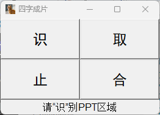

# image-to-ppt
初心：我们在参加会议的时候，有时会想把一些好的PPT备份下来，很多参会情况下只能自己拍摄照片。后续的照片处理（image——>PPT）的过程就很痛苦了，于是此项目诞生了..

功能概述：批量处理照片，识别照片中的PPT部分，自动裁剪+变形，并生成为一个PPT文件

**Done：**

1. 模型的训练及增量训练；

2. 照片中PPT区域的识别（如效果较差则需增量训练）;

3. 将PPT区域裁剪出来（XXX目前是以区域的最大最小值裁剪出来的矩形）；

4. 生成PDF/PPT文件；

5. 增加屏幕视频（线上会议等）自动截取PPT图片并生成PPT文件功能；

6. 开发第5项功能界面，界面如下。

   

**Todo：**

1. 在`Mask R-CNN`模型基础上，将识别出来的PPT区域拟合为不规则四边形，以四边形的顶点做图形变换，形成矩形PPT图片；
2. 另一个思路：识别照片中PPT区域的边界，以识别到的边界顶点做图形变换，形成矩形PPT图片；
3. 屏幕视频截图 ——> 直接截取视频流（无需置顶显示视频）。

## 使用

1. 将照片下载到“raw”系列文件夹中（**拍照时尽量拍全PPT区域，否则会影响识别准确度！**）；
2. 将批处理工具放到上述文件夹中，使用批处理工具“批-删部分文件名.bat”删除文件中的中文；
3. 使用“labelme”标注照片中的ppt区域，标签设置为“ppt”，并保存标注文件到“annotate”系列文件夹中；
4. 运行“train_maskrcnn.py”主函数，选择“第一次训练”或“继续训练”mask_rcnn模型；
5. 运行“main.py”主函数，批处理待处理照片，并生成ppt文件；
6. 运行“test_maskrcnn.py”可对一张照片进行单独测试。

## 初步开发思路

1. **图像预处理**：使用`Labelme`标注图片，将图片转换为张量。
2. **PPT区域检测**：使用 `Mask R-CNN` 模型检测图片中的PPT区域。
3. **PPT区域裁剪**：根据检测结果裁剪出PPT区域。
4. **透视调整**：如果需要，进行透视变换，将PPT区域调整为标准矩形。
5. **批量处理**：处理多张图片，批量裁剪和调整PPT区域。
6. **生成PDF/PPT**：将处理后的PPT图片合并为一个文件。

## 主要版本号

| Name | Version |
| ---- | ------- |
| python |          3.8.0 |
| torch |                     2.4.0 |
| torchvision |               0.19.0 |
| nuitka         | 1.0.6       |
| opencv-python | 4.5.4.60 |

## 打包失败

通过`nuitka`打包 第5项功能，以下版本均已测试，打包均以失败告终...

| Name          | Version               |
| ------------- | --------------------- |
| python        | 3.8；3.10             |
| torch         | 2.4.0                 |
| torchvision   | 0.19.0                |
| nuitka        | 0.6.8.4；1.0.6；1.9.5 |
| opencv-python | 4.5.4.60；其他版本    |

## 小知识XXX

在目标检测中， Faster R-CNN 等模型默认输出的是矩形边界框。
如果需要检测不规则的四边形，可以使用 实例分割模型，比如 Mask R-CNN，它可以生成像素级的分割掩码，从而捕获不规则的形状。